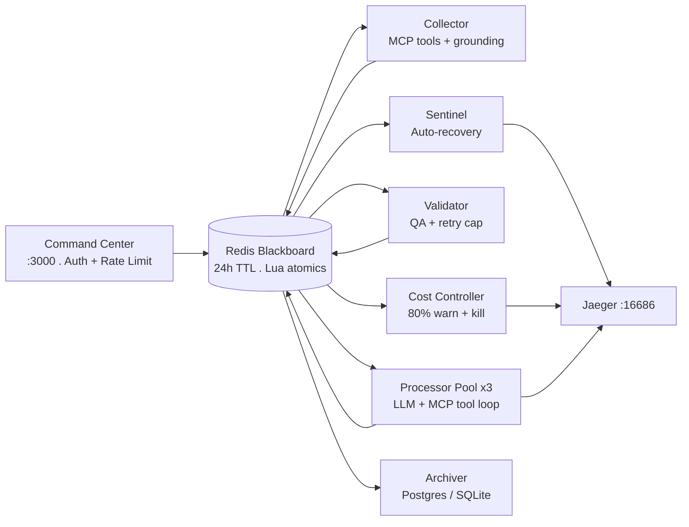

# PipeForge-AI

**Self-hostable autonomous agent infrastructure. No framework lock-in.**

---

## What Is PipeForge-AI?

A **lightweight, pro-code agent runtime** built from first principles -- no LangChain, no CrewAI, no framework tax.

Agents run as ephemeral processes. State lives in a Redis Blackboard. Every session has a financial budget. Stalled agents recover automatically. Every action emits an OpenTelemetry span. Any MCP tool server plugs in with one line.

1. **"Denial of Wallet" attacks:** Prevents runaway costs
2. **Silent Agent Death:** Ensures reliability via atomic state recovery
3. **Black Box Operations:** Provides full observability via OpenTelemetry

> Most teams wake up to $400 OpenAI bills from infinite loops.
> PipeForge kills runaway sessions before they drain your wallet.

*Read the full deep-dive in our documentation: https://github.com/ashwin9390/Pipeforge-AI/blob/main/docs/Why_PipeForge.md*
---
## Testing & Verification

The PipeForge test suite is verified with **12/12 tests passing**.

* **Coverage:** Validates budget reservation, security pattern detection, retry routing, TTL handling, and cost attribution
* **Full Report:/docs/TEST_Results.md
---
## Quick Start

**Requires:** Docker Desktop + OpenAI API key.

```bash
git clone [[https://github.com/ashwin9390/pipeforge-AI](https://github.com/ashwin9390/Pipeforge-AI).git]
cp .env.example .env        # Add OPENAI_API_KEY and UI_API_KEY
chmod +x launch.sh
./launch.sh
```

Open the URL printed by `launch.sh`:

| Service | URL | Purpose |
|---|---|---|
| **Command Center** | `http://localhost:3000?api_key=YOUR_KEY` | Launch tasks, live spend tracking |
| **Jaeger Traces** | `http://localhost:16686` | Distributed trace viewer |
| **Dozzle Logs** | `http://localhost:8080` | Real-time agent thoughts |
| **Redis Insight** | `http://localhost:5540` | Blackboard state viewer |

---

## Architecture



**The pipeline:** `Collector -> Processor -> Validator -> FINISH`

Each node is an ephemeral process that reads state, acts, writes state, and exits. The Blackboard persists. The agents are disposable.

---

## Node Reference

| Node | File | Role |
|---|---|---|
| **Collector** | `collector_node.py` | Fetches ground-truth facts via MCP tools before LLM reasoning |
| **Processor** | `processor_node.py` | Core LLM reasoning with MCP tool-call loop (max 5 rounds) |
| **Validator** | `validator_node.py` | QA check -- rejects to `queue_processor_retry` (separate from fresh tasks) |
| **Sentinel** | `sentinel_node.py` | Heartbeat monitor -- atomically requeues stalled sessions |
| **Cost Controller** | `cost_controller.py` | tiktoken-accurate spend tracking -- warns at 80%, kills at limit |
| **Archiver** | `archiver_node.py` | Moves completed sessions from Redis to Postgres/SQLite |
| **Supervisor** | `supervisor.py` | Routes sessions + two-layer security scan (regex + LLM) |

---

## MCP Tool Integration

Collector and Processor call any MCP-compatible tool server. Configure in `.env`:

```bash
MCP_SERVERS=[
  {"name": "brave-search", "url": "http://brave-mcp:3001/sse"},
  {"name": "filesystem",   "url": "http://fs-mcp:3002/sse"}
]
```

Tools are auto-discovered at startup and passed to the LLM as OpenAI function definitions. The Processor runs a tool-call loop until the task is complete or 5 rounds are exhausted.

---

## OpenTelemetry Tracing

Every node emits spans. Jaeger is bundled. Switch backends with one env var:

```bash
# Grafana Tempo, Datadog, Honeycomb, etc.
OTEL_EXPORTER_OTLP_ENDPOINT=http://your-backend:4317
```

Span attributes on every LLM call:
```
session.id        pf_a1b2c3d4
node.name         processor
llm.model         gpt-4o-mini
llm.input_tokens  342
llm.output_tokens 187
llm.cost_usd      0.000161
mcp.tools_used    brave_search
```

---

## Benchmarks

Run against your own setup:

```bash
python bench_pipeforge.py --mode full       # All 5 benchmarks
python bench_pipeforge.py --mode llm        # Real LLM latency
python bench_pipeforge.py --mode redis      # Blackboard handoff speed
python bench_pipeforge.py --mode e2e --tasks 10   # Full pipeline
python bench_pipeforge.py --mode swarm --tasks 50  # Concurrent injection
python bench_pipeforge.py --mode recovery   # Sentinel recovery timing
```

Results saved to `benchmark_results.json`. **Publish your numbers** -- paste them here after running.

---

## vs Frameworks

| Feature | LangGraph | CrewAI | AutoGen | **PipeForge** |
|---|---|---|---|---|
| Financial circuit breaker | [NO] | [NO] | [NO] | [YES] tiktoken-accurate |
| Self-healing (Sentinel) | [NO] | [NO] | [NO] | [YES] atomic requeue |
| MCP tool support | plugin | plugin | plugin | [YES] native |
| OpenTelemetry traces | LangSmith only | [NO] | [NO] | [YES] any OTLP backend |
| Framework lock-in | LangChain | CrewAI | Microsoft | [YES] none |
| Retry queue separation | [NO] | [NO] | [NO] | [YES] |
| Redis TTL safety net | [NO] | [NO] | [NO] | [YES] 24h auto-expire |
| Two-layer security scan | [NO] | [NO] | [NO] | [YES] regex + LLM |

---

## Cost Ledger -- Per-Call Audit Trail

Every LLM call (collector, processor, validator) writes a structured entry to a
per-session Redis Stream. This answers "how did we end up at this spend" with
an exact, ordered, queryable record -- not just a cumulative total.

Each ledger entry captures: node, model, input/output tokens, exact cost,
call purpose, latency, and any error -- with a timestamp.

View it three ways:

1. **Web UI** -- click "View cost ledger" on any session card in the Command Center.
2. **CLI** -- `python3 inspect_ledger.py pf_a1b2c3d4`
3. **Programmatically** -- `bb.get_cost_ledger(sid)` / `bb.ledger_summary(sid)`

Example CLI output:
```
  TIME                NODE        PURPOSE                   TOKENS        COST   LATENCY
  ------------------------------------------------------------------------------------
  2026-06-30 10:35:35  collector   ground_truth_fetch           200  $0.000066    820ms
  2026-06-30 10:35:35  processor   main_reasoning                527  $0.000163   1240ms
  2026-06-30 10:35:35  validator   qa_check_retry_0              455  $0.000089    610ms
  2026-06-30 10:35:35  processor   main_reasoning_retry_1        590  $0.000182   1311ms
  2026-06-30 10:35:35  validator   qa_check_retry_1              480  $0.000086    590ms

  TOTAL CALLS: 5
  TOTAL COST:  $0.000586

  BREAKDOWN BY NODE:
    collector       1 calls   $0.000066   200 tokens
    processor        2 calls   $0.000345   1117 tokens
    validator       2 calls   $0.000175   935 tokens
```

This immediately shows the validator retried twice and the processor retried
once -- the actual cause of the spend, not just the final number.

The ledger uses a Redis Stream (`XADD`/`XRANGE`), capped at 500 entries per
session and expiring after 24h alongside the session itself.


| Variable | Default | Description |
|---|---|---|
| `OPENAI_API_KEY` | required | Your OpenAI key |
| `UI_API_KEY` | auto-generated | Command Center auth secret |
| `WORKER_MODEL` | `gpt-4o-mini` | Model for all agent nodes |
| `SESSION_BUDGET_USD` | `0.50` | Kill threshold per session |
| `MCP_SERVERS` | `[]` | JSON array of MCP server configs |
| `OTEL_EXPORTER_OTLP_ENDPOINT` | `` | OTLP backend (blank = console) |
| `WATCHDOG_STALL_SEC` | `60` | Stall threshold in seconds |
| `MAX_REVIEWER_RETRIES` | `2` | Max Processor/Validator cycles |
| `DATABASE_URL` | `` | Postgres URI (blank = SQLite) |

---

## Scaling

```bash
docker compose up -d --scale processor-agent=10
```

---

## Testing

```bash
python tests/test_pipeforge.py    # 8 unit tests, no factory needed
pytest tests/ -v
```

---

## Project Structure

```
pipeforge/
+-- shared/
|   +-- token_utils.py      # tiktoken accurate cost (not char/4 heuristic)
|   +-- redis_utils.py      # BlackboardClient -- Lua atomics, 24h TTL
|   +-- security.py         # Two-layer: regex + LLM semantic classifier
|   +-- auth.py             # API key auth
|   +-- telemetry.py        # OTel TracerProvider, @trace_node, span()
|   +-- mcp_tools.py        # MCP client, tool registry, tool-call loop
|
+-- collector_node.py       # Ground truth + MCP tools
+-- processor_node.py       # LLM reasoning + MCP loop
+-- validator_node.py       # QA + retry queue
+-- sentinel_node.py        # Heartbeat + atomic recovery
+-- cost_controller.py      # tiktoken spend + circuit breaker
+-- archiver_node.py        # Cold storage (Postgres/SQLite)
+-- supervisor.py           # Routing + security scan
+-- web_ui.py               # FastAPI command center
|
+-- bench_pipeforge.py      # Real benchmarks (5 modes)
+-- chaos_monkey.py         # Fault injection
+-- tests/test_pipeforge.py # 8 unit tests
+-- docker-compose.yml      # All services + Jaeger
+-- launch.sh
+-- docs/                   # Technical documentation & test reports

```

---

## Author & License
* **Author**: Ashwin — [@ashwin9390](https://github.com/ashwin9390)
* **License**: Apache 2.0. See [LICENSE] ([LICENSE](https://github.com/ashwin9390/Pipeforge-AI/blob/main/LICENSE))
* **GitHub**: [https://github.com/ashwin9390/Pipeforge-AI/blob/main/LICENSE]
